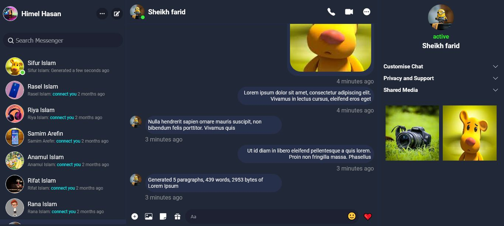

# Real time chat application like facebook messenger

# Application feature

  - Real time Text Messaging
  - Real time image Messaging
  - Real time emoji Messaging
  - Real time message seen, unseen system
  - Real time message received and sending sound
  - Real time received message notification system
  - User search system
  - User login and register system
  - Application dark and light mode system
  
  
  
# Following tools are used to develop the application
    
  ## Frontend Tools
    
  - React Js
  - Redux
  - socket.io-client
  - Sass
    
  ## Backend Tools
    
  - Programming languages : JavaScript
  - Node Js
  - Frameworks : Express Js
  - Databases : MongoDB
  - Socket.io
## How to run this project
  ### Download NodeJs , mongoDB community server , mongoDB compass and install

  ###  1 . [NodeJS download](https://nodejs.org/en/download)
  ###  2 . [MongoDB community server download](https://www.mongodb.com/try/download/community)
  ###  3 . [MongoDB compass download](https://www.mongodb.com/try/download/shell)

    Git clone https://github.com/richard-olajuwon/chat-application.git

## Backend install

  ### Run this command in root folder
     npm install --legacy-peer-deps

## Frontend install

  ### Run this command in frontend folder
    npm install --legacy-peer-deps
    npm audit fix --force
  
## Socket install

  ### Run this command in root folder
    npm run socket-install

## Run project

  ### Run this command in root folder
    npm run dev

## if application doesn't run
  ## 1. again run this command in frontend folder
      npm audit fix --force

## Again Run project

  ### Run this command in root folder
    npm run dev

